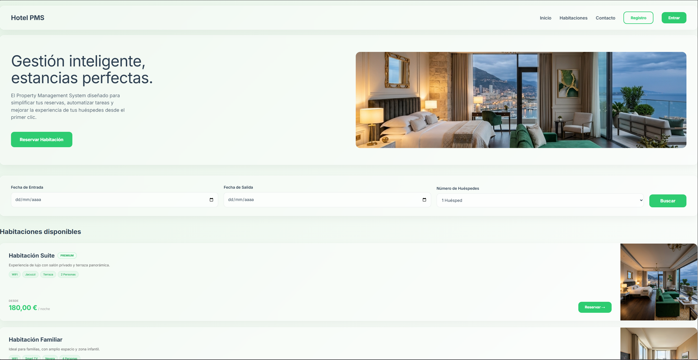
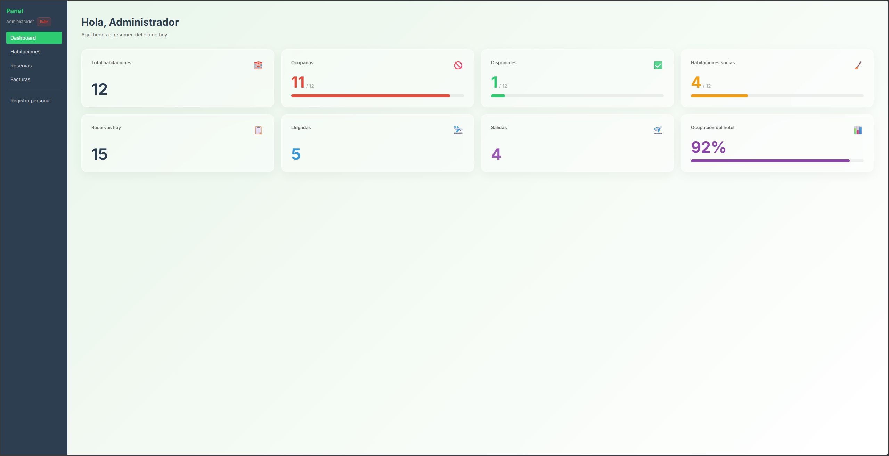

# PMS_TFG — Sistema de Gestión Hotelera


**TFG de Mario Gómez (@babayagapa) | 2 DAW | IES Venancio Blanco, Salamanca**

Sistema web Full-Stack para gestionar habitaciones y reservas de hotel.  
Desarrollado con React, Laravel, MongoDB y creado con Docker.

---

## 📸 Capturas del Proyecto

### Landing Page
Interfaz moderna basada en *Glassmorphism* para que los clientes busquen disponibilidad.
> 

### Dashboard
Panel de control para la gestión de estados de habitaciones (limpias, ocupadas, en mantenimiento) y reservas.
> 

---

## ⚙️ Requisitos

- **Docker Desktop** instalado y en ejecución.
- **Git**

No hace falta tener PHP, Node ni MongoDB instalados en local. Docker lo gestiona absolutamente todo.

---

## 🚀 Arrancar el proyecto (Primera vez)

```bash
# 1. Clonar el repositorio
git clone https://github.com/babayagapa/PMS_TFG.git
cd PMS_TFG

# 2. Crear el archivo de variables de entorno(asegurarse de tener todos copiados porque son 3 en total 1back 2front y 3raiz)
cp .env.example .env

# 3. Construir y levantar los contenedores
docker-compose up -d --build
```
El contenedor del backend genera automáticamente las claves y genera la base de datos en el primer arranque. Tarda unos 30-60 segundos.

```bash
# 4. Comprobar que todo funciona
docker-compose logs backend
# Y deberia de mostrar: "Iniciando Laravel en 0.0.0.0:8000..."
```

Abrir en el navegador: **http://localhost:5173**

### 🔑 Credenciales de prueba

| Rol | Email | Password |
|---|---|---|
| Admin | admin@hotel.com | admin123 |
| Recepcionista | recepcion@hotel.com | recep123 |
| Limpieza | limpieza@hotel.com | limp123 |

### 🌍 Acceso remoto (Cloudflare Tunnel)
El proyecto está preparado para ser expuesto mediante túneles Zero Trust.

Para crear un túnel público temporal manualmente:

```bash
# Ejecutar el demonio de Cloudflare desde el contenedor frontend
docker exec -it pms_frontend npx cloudflared tunnel --url http://localhost:5173
```
Genera un enlace público que apunta a tu equipo local.

---

## 🛠️ Servicios y Arquitectura

### Flujo de la arquitectura:
`Navegador` → `React (5173)` → `Axios` → `Laravel API (8000)` → `MongoDB (27017)`

| URL | Servicio |
|---|---|
| http://localhost:5173 | Frontend React |
| http://localhost:8000/api | API Laravel |
| http://localhost:8081 | Panel MongoDB (Mongo Express) |

---

## 💾 Backup de datos

Para extraer una copia de las reservas actuales desde MongoDB:

```bash
docker exec pms_mongo mongoexport \
  --db pms_db --collection reservas \
  --out /tmp/backup.json
docker cp pms_mongo:/tmp/backup.json ./backup_$(date +%Y%m%d).json
```

---

## 🌿 Ramas

- `main` — Código estable y testeado.
- `develop` — Desarrollo activo.
